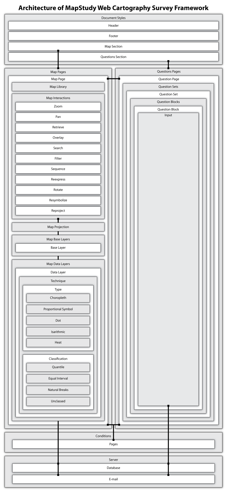

#  MapStudy

# What is MapStudy?

MapStudy is an integrated, modularized framework for the creation of survey applications designed to test cartographic design and interaction hypotheses in a modern web map environment. It leverages Postgresql and PHP on the server side and Javascript, jQuery, Leaflet, and D3 on the client. MapStudy is being developed specifically for use in the University of Wisconsin-Madison Cartography program through the support of the UW-Madison Cartography Lab and the Wisconsin Alumni Research Foundation.

## What is the status of MapStudy?

The MapStudy framework is currently in beta release, version 0.1. Note that not all functionality is complete. At this time, Leaflet is the only active map library.

## Can I have a preview please?

To see a demo app created with the MapStudy framework, [click here](http://uwcart.github.io/mapstudy/).

To access the setup application (which has a live preview feature), [click here](http://grad.geography.wisc.edu/cmsack/mapstudy/setup/)

## Documentation - Version 0.1

## Contents

#### [About the API Documentation](#about-the-api-documentation-1)

#### [Setup](#setup-1)

#### [Config files](#config-files-1)

#### &emsp;[Styles](#styles-1)

#### &emsp;[Map](#map-1)

#### &emsp;[Questions](#questions-1)

#### &emsp;[Conditions](#conditions-1)

#### &emsp;[Param](#param-1)

#### [Framework Architecture](#framework-architecture-1)

## About the API documentation:

MapStudy is a flexible framework for creating map-based survey applications. It includes a range of components that are selected by setting and extending the options in the *.json* files within the *config* directory. For now, those files must be edited manually in a basic text editor such as Sublime or Notepad++. Hopefully there will eventually be a helper GUI for setting up the config files.

The API documentation lists the options available in the config files. Each option is shown as code, with the option key to the left of a colon and each explicit possible value `between asterisks (*)`. **Everything `between asterisks (*)` is optional; everything else is required.** Special cases are noted at their respective documentation sections.

This documentation assumes a basic working knowledge of JSON formatting, geographic data structure, and geographic databases.

## Setup:

1. Clone or download a zipped copy of the framework from the [Github page](https://github.com/uwcart/mapstudy).

2. Unzip the files and place them where you want to provide access to the survey&mdash;either on a public server or a private localhost server.

3. Replace the *logo.png* file in the *img* folder with your own icon if desired.

4. If you will create a thematic map, gather geographic data and convert to GeoJSON format or store it in a PostGIS database. Geographic data should include every feature that will be mapped and each attribute that will be used to generate the thematic map. Thematic attributes should be numerical. Options for adding data to the map are covered in the *map.json* section below. A good source of geographic base data is [Natural Earth](http://www.naturalearthdata.com/).

5. If you plan to embed a static map image or pre-rendered web map from a service such as [CartoDB](https://cartodb.com/), prepare that map separately. *Note that if you do this, you lose the benefit of the embedded user interaction logging.*

6. Set up a PostgreSQL, MySQL, or Microsoft Access database to store question answers and interaction logs. The MapStudy application will need administrator-level access to that database.

7. Edit and extend each *.json* file in the *config* directory using the options below. Your edits should be reflected immediately in the browser upon loading or reloading *index.html*.

## Config files:

The remainder of the documentation describes each of the configuration files stored in the *config* folder and the options available with each. It is recommended to use the [form-based setup application](http://grad.geography.wisc.edu/cmsack/mapstudy/setup/) to create these, as it makes it easy to configure a custom MapStudy application without having to open up the config files and write a bunch of JSON code. But be forewarned that the setup app is still *very* beta; use at your own risk and compare the resulting files with this documentation if you run into trouble!

## Styles
###Filename: styles.json

This config file is set up by default to style two page sections: the header and the footer. Other sections may be added as additional section objects, but it is not recommended.

#### styles.sectionId

	"sectionId": *"header"* *"footer"* *"m"* *"q"*

The `id` attribute of each HTML `<section>` element on the page.

| Value  | Description | Default |
| :------------: | :----------- | :------------------- |
| `*"header"*` | The page header; the banner on top of the page. If there is no section object with a `sectionId` of `header`, a strip of white space will appear at the top of the page. | Orange background with a "MapStudy Template" heading and MapStudy icon. |
| `*"footer"*` | The page footer; the strip at the bottom of the page. If there is no section object with a `sectionId` of `footer`, a strip of white space will appear at the bottom of the page.| Orange background with placeholder text content. |
| `*"m"*` | The section holding the map, on the left half of the main part of the web page. You can add a third section object for this or change one of the existing objects, but it's not recommended. Any `cssAttributes` will override the styles in *style.css*, but any HTML content will not be overridden. | Example map |
|`*"q"*` | The section holding the questions, on the right half of the main part of the web page. See `*"m"*` above | Example questions |

#### styles.cssAttributes

	"cssAttributes": {*"background-color": "color"* *, other optional CSS*}

An object holding all CSS styles that will be used to style the section.

| Value  | Description | Default |
| :------------: | :----------- | :------------------- |
| `*"background-color": "color"*` | An RGB or HEX value that will be the background color of the section. | "rgb(247,154,66)" |
| `*, other optional CSS*` | Any styles added here will override those contained in *style.css*. Be careful. | N/A |

#### styles.logo-url

	"logo-url": *"url"*

A URL or relative path to the logo that appears in the `header` section.

| Value  | Description | Default |
| :------------: | :----------- | :------------------- |
| `*"url"*` | Only works in an object containing a `sectionId` of `header`. | `"img/logo.png"` In general, there is no need to change this&mdash;just replace *logo.png* in the *img* folder with a file that holds your logo that's also called *logo.png*. The logo should be at least 64 pixels high. |

#### styles.content

	"content": *"HTML content"*

An HTML string that will be added to the section. The `content` of the `header` section object will automatically be formatted as an `<h1>` heading. The content of the `footer` section will be 80% of the height of normal paragraph text on the page. Adding social media buttons here should work.

---

## Map
###Filename: map.json

This config file holds the configuration options necessary to create the map. MapStudy will eventually support creating web maps with interaction logging in [Leaflet](http://leafletjs.com/), [Mapbox-GL](https://www.mapbox.com/mapbox-gl-js/api/), and [D3](http://d3js.org/), and maps with no interaction logging as any of the first three plus a static image, REST service, or embedded iframe with any other web mapping service (e.g. [CartoDB](https://cartodb.com/) and [ArcGIS Online Viewer](https://www.arcgis.com/home/webmap/viewer.html)).

In the descriptions below, `map` refers to each object in the map.json `pages` array. The map.json file should be structured thus:

	{
		"pages": [
			{
				//map options for page 1
			},
			{
				//map options for page 2
			},
			...
		]
	}

#### map.pages[page].library

	"library": *"Leaflet"* *"Mapbox-GL"* *"D3"* *"image"* *"REST"* *"iframe"*

The web mapping library or service to use to create the map. Currently only supports `Leaflet`.

#### map.pages[page].interactions

	"interactions": {
		*"zoom"*
		*"pan"*
		*"retrieve"*
		*"overlay"*
		*"search"*
		*"filter"*
		*"sequence"*
		*"reexpress"*
		*"rotate"*
		*"resymbolize"*
		*"reproject"*,
		*"reset"*
	}

An object containing the interactions that should be enabled on the map. Each interaction in turn references an object designating whether the interaction should be logged and options for its implementation.

#### map.pages[page].interactions[interaction].logging

			*"logging"* *"toggle"*: *true* *false*

Whether the interaction should be logged. Available for each interaction.

| Value  | Description | Default |
| :------------: | :----------- | :------------------- |
| `*true*` | If `true`, interactions will be logged. | `false` |

#### map.pages[page].interactions[interaction].toggle

			*"toggle"*: *true* *false*

Whether to add a switch for toggling the interaction to the top toolbar on the map. Available for each interaction.

| Value  | Description | Default |
| :------------: | :----------- | :------------------- |
| `*true*` | If `true`, interaction switch will be added and the interaction will be "off" by default. If `false`, the interaction will always be "on". | `false` |

#### map.pages[page].interactions.zoom

		*"zoom"*: { *"logging"* *"toggle"* *"interface"* }

Zoom interaction. Must be included to allow the user to change the zoom level/scale of the map.
If an empty object, `logging` is considered to be `false`.

#### map.pages[page].interactions.zoom.interface

		*"interface"*: {
			*"touch": `false`*
			*"scrollWheel": `false`*
			*"doubleClick": `false`*
			*"box": `false`*
			*"keyboard": `false`*
			*"widget": `false`*
		}

How to implement zoom. All default to `true`; add only to disable an interface option.

| Value  | Description | Default |
| :------------: | :----------- | :------------------- |
| `*"touch"*` | Enables pinch-zoom on touch-enabled devices. | `true` |
| `*"scrollWheel"*` | Enables zooming with the scroll wheel on a wheeled mouse. | `true` |
| `*"doubleClick"*` | Enables zooming in with a mouse double-click or a double-tap on touch-enabled devices. | `true` |
| `*"box"*` | Enables box-zoom using a mouse and the shift key. | `true` |
| `*"keyboard"*` | Enables zooming with the + and - keys on a keyboard; it is recommended to keep this option `true` for accessibility. | `true` |
| `*"widget"*` | Implements a zoom widget with + and - buttons in the lower-left corner of the map. | `true` |

#### map.pages[page].interactions.pan

		*"pan"*: { *"logging"* *"toggle"* *"interface"* }

Pan interaction. Must be included to allow the user to change map center by dragging the map.

#### map.pages[page].interactions.pan.interface

		*"interface"*: {
			*"drag": `false`*
			*"keyboard": `false`*
			*"widget": `false`*
		}

How to implement pan. All default to `true`; add only to disable an interface option.

| Value  | Description | Default |
| :------------: | :----------- | :------------------- |
| `*"drag"*` | Enables panning by clicking and dragging or finger-dragging on the map. | `true` |
| `*"keyboard"*` | Enables panning using the arrow keys of a keyboard; it is recommended to keep this option `true` for accessibility. | `true` |
| `*"widget"*` | Implements a pan widget with arrow buttons in the lower-left corner of the map. | `true` |

#### map.pages[page].interactions.rotate

		*"rotate"*: { *"logging"* *"toggle"* }

Rotate interaction. Allows the user to rotate the map. Only available with Mapbox-GL and D3 libraries.

#### map.pages[page].interactions.retrieve

		*"retrieve"*: { *"logging"* *"toggle"* *"interface"* }

Retrieve interaction. Allows the user to get information about features through a popup and/or window.

#### map.pages[page].interactions.retrieve.interface

		*"interface"*: {
			*"popup": `false`*
			*"window": `false`*
		}

How to implement retrieve. All default to `true`; add only to disable an interface option.

| Value  | Description | Default |
| :------------: | :----------- | :------------------- |
| `*"popup"*` | Gives the user access to popups on each data layer feature that show all of the feature's display attributes. | `true` |
| `*"window"*` | Implements a widget-like information window in the lower-left corner of the map where information about each feature is displayed when the feature is clicked on. | `true` |

#### map.pages[page].interactions.overlay

		*"overlay"*: { *"logging"* *"toggle"* "dataLayers" }

Overlay interaction. Must be included to allow the user to add or remove data layers on the map. Must include a list of `dataLayers` for which to enable the interaction.

#### map.pages[page].interactions.overlay.dataLayers

		"dataLayers": []

An array containing the names of `dataLayers` to allow users to add and remove with a layers control. Required. Each data layer will be represented by a checkbox in the layers control, allowing any number of included layers to be added or removed.

#### map.pages[page].interactions.underlay

		*"underlay"*: { *"logging"* *"toggle"* }

Underlay interaction. Must be included to allow the user to change base layers on the map. If included, the names of all `baseLayers` will be shown with radio buttons in a layers control. Only one base layer can appear on the map at a time.

#### map.pages[page].interactions.search

		*"search"*: { *"logging"* *"toggle"* "dataLayers" }

Search interaction. Creates a search box on the map.

#### map.pages[page].interactions.search.dataLayers

			"dataLayers": []

An array of the `dataLayers` to include in the search. Must have at least one value to enable searching.

#### map.pages[page].interactions.filter

		*"filter"*: { *"logging"* *"toggle"* "dataLayers" *"tool"* }

Filter interaction. Creates a filter tool on the map.

#### map.pages[page].interactions.filter.dataLayers

			"dataLayers": []

An array of the `dataLayers` to include in the filter tool. Must have at least one value to enable filtering. Each data layer will have its own line in the filter tool.

#### map.pages[page].interactions.filter.tool

			*"tool"*: *"slider"* *"logic"*

Which interface tool to use for filtering.

| Value  | Description | Default |
| :------------: | :----------- | :------------------- |
| `*"slider"*` | Implements a slider with two handles as the filter tool. Data layers on map will respond immediately to user input. | `slider` |
| `*"logic"*` | Implements a dropdown menu with "equal to", "not equal to", "greater than", and "less than" options, followed by a text box for user input, followed by a dropdown menu with blank, "and", and "or" options, followed by a repeat of the first dropdown and text box (e.g., "attribute is greater than 12 and less than 24"; "attribute is equal to 15"). Data layers on map will respond immediately to user input. | `slider` |

#### map.pages[page].interactions.sequence

		*"sequence"*: { *"logging"* *"toggle"* "dataLayers" *"tool"* }

Sequence interaction. Allows the user to change the expressed attribute separately for each of the listed `dataLayers`. Interface tool allows the user to cycle through each layer's `displayAttribute`s in the order in which they are listed for the layer and the layer's specified `expressedAttribute`.

#### map.pages[page].interactions.sequence.dataLayers

			"dataLayers": []

An array of the `dataLayers` to include in the sequence tool. Must have at least one value to enable sequencing. Each data layer will have its own line in the sequence tool.

#### map.pages[page].interactions.sequence.tool

			*"tool"*: *"buttons"* *"slider"*

Which interface tool to user for sequencing.

| Value  | Description | Default |
| :------------: | :----------- | :------------------- |
| `*"buttons"*` | Implements forward and back buttons on the map with which to sequence through the attributes. | `buttons` |
| `*"slider"*` | Implements a slider on the map with which to sequence through the attributes. | `buttons` |

#### map.pages[page].interactions.reexpress

		*"reexpress"*: { *"logging"* *"toggle"* }

Reexpress interaction. For each visible data layer, allows the user to change the visual technique in which the `dataLayer` is expressed to any of the techniques listed in the layer's `techniques` array (see [map.pages[page].dataLayers[i].techniques](#mappagespagedatalayersitechniques)).

#### map.pages[page].interactions.resymbolize

		*"resymbolize"*: { *"logging"* *"toggle"* *"reclassify"* *"rescale"* *"recolor"* }

Resymbolize interaction. Allows the user to manipulate the classification scheme via the legend. If included, users will be able to change the classification parameters of graduated maps (choropleth or proportional symbol), change the symbol scale or interval (proportional symbol, dot, isarithm, or heat), and/or change the symbol color (choropleth or proportional symbol). If `reclassify`, `rescale`, or `recolor` are omitted, their functionality will be included by default.

#### map.pages[page].interactions.resymbolize.reclassify

	*"reclassify"*: *true* *false*

Change the classification scheme, the number of classes, and the class breakpoints.

| Value  | Description | Default |
| :------------: | :----------- | :------------------- |
| `*"true"*` | Allows the user to change the classification scheme, the number of classes, and the class breakpoints. Only available for choropleth and proportional symbol maps. | `true` |
| `*"false"*` | Doesn't allow the user to change the classification scheme, the number of classes, and the class breakpoints. Only available for choropleth and proportional symbol maps.| `true` |

#### map.pages[page].interactions.resymbolize.rescale

	*"rescale"*: *true* *false*

Changing the symbol scaling if a proportional symbol map, or the interval if a dot or isarithm map.

| Value  | Description | Default |
| :------------: | :----------- | :------------------- |
| `*"true"*` | Allows the user to change the symbol scaling if a proportional symbol map, or the interval if a dot or isarithm map. | `true` |
| `*"false"*` | Doesn't allow the user to change the symbol scaling if a proportional symbol map, or the interval if a dot or isarithm map.| `true` |

#### map.pages[page].interactions.resymbolize.recolor

	*"recolor"*: *true* *false*

 Changing the symbol color.

| Value  | Description | Default |
| :------------: | :----------- | :------------------- |
| `*"true"*` | Allows the user to change the symbol color. For a choropleth map, the user may choose from any sequential ColorBrewer scale. For proportional symbol map, the user may enter any HEX value or choose from a palette the fill color of the symbols. | `true` |
| `*"false"*` | Doesn't allow the user to change the symbol color.| `true` |

#### map.pages[page].interactions.reproject

		*"reproject"*: { *"logging"* *"toggle"* "projections" }

Allows the user to change the map projection. Only available with the D3 library.

#### map.pages[page].interactions.reproject.projections

			"projections":[]

An array of `projection` objects with the projection name and D3-style projection parameters for each alternative projection to include. Must have at least one projection object to enable reprojection.

#### map.pages[page].interactions.reset

		*"reset"*: { *"logging"* "toggle" }

Allows the user to reset the map to its original state. The same reset button can also be added through `map.pages[page].mapOptions.resetButton`, but including it as an interaction allows for the `reset` interaction to be logged. If only included in the `interactions` object, `"toggle"` **must** be set to `true` or the button will not appear.

#### map.pages[page].mapOptions

	*"mapOptions"*: { *library options* *legend* *resetButton* }

An object to hold any map options applied on the instantiation of a Leaflet, Mapbox-GL, or REST map. Not available for any other `library options`. If no `mapOptions` are included, library defaults will be applied. Refer to the [Leaflet](http://leafletjs.com/reference.html#map-options) or [Mapbox-GL](https://www.mapbox.com/mapbox-gl-js/api/#Map) documentation for lists of possible options for those libraries. REST `mapOptions` will be added as parameters to the map URL, and are thus dependent on the map server configuration. The `legend` option is a special option, described below.

#### map.pages[page].mapOptions.legend

	*"legend"*: *true* *false*

Including a legend on the map.

| Value  | Description | Default |
| :------------: | :----------- | :------------------- |
| `*"true"*` | A legend is added to the map showing symbols for all `dataLayers`. | `true` |
| `*"false"*` | A legend is not added to the map. | `true` |

#### map.pages[page].mapOptions.resetButton

	*"resetButton"*: *true* *false*

Whether to include a button allowing the participant to reset the map to its original state. The button appears as an interaction toggle switch and can also be added through `map.pages[page].interactions.reset` (in which case `toggle` for the interaction must be set to `true`).

| Value  | Description | Default |
| :------------: | :----------- | :------------------- |
| `*false*` | If `true`, reset button will be included | `false` |

#### map.pages[page].projection

	*"projection"*: { "name" *"options"* }

An object containing the projection name and parameters for a D3 projection. Only available with the D3 `library options`. Must be included to instantiate a D3 map.

#### map.pages[page].projection.name

		"name": "projection name"

The name of the D3 projection, a string. Required if using D3. All [standard projections](https://github.com/mbostock/d3/wiki/Geo-Projections#standard-projections) and [extended projections](https://github.com/d3/d3-geo-projection/#extended-geographic-projections) are supported. The `name` is lowercase and does not include a reference to the `d3.geo` library object or parentheses (e.g. `"albers"`, not `"d3.geo.albers()"`).

#### map.pages[page].projection.options

		*"options"*: {}

An object containing the [projection parameters](https://github.com/mbostock/d3/wiki/Geo-Projections) for the chosen projection. If not included, options will be projection defaults. Refer to the example block for your chosen projection to see which parameters are used. While in writing D3 code, each projection parameter is implemented as a selection operator method with the values as method parameters, here you give the parameter as an object key string followed by the parameter values. For example:

	//D3 projection block in JavaScript
	projection = d3.geo.albers()
	    .center([0, 55.4])
	    .rotate([4.4, 0])
	    .parallels([50, 60])
	    .scale(6000)
	    .translate([width / 2, height / 2]);

in *map.json* becomes

	"projection": {
		"name": "albers",
		"options": {
			"center": [0, 55.4],
			"rotate": [4.4, 0],
			"parallels": [50, 60],
			"scale": 6000,
			"translate": ["width / 2", "height / 2"]
		}
	}

Make sure that any value that is either a string or a mix of numbers and strings is represented as a string with double-quotes. The variables `"width"` and `"height"` will be recognized as the map width and the map height. You may wish to adjust these after you see the instantiated map.

#### map.pages[page].baseLayers

	*"baseLayers"*: [{
		"name"
		"source"
		"layerOptions"
	}]

An array of objects containing the information needed to add a basemap layer for any `library options`. Only the first base layer object will be rendered on the map on load. All `baseLayers` will be included as base layer options in the layers control if `underlay` is an included interaction.

#### map.pages[page].baseLayers[i].name

		"name": layer name

The name of the base layer; a string. If `overlay` is included in the `interactions`, this name will appear in the layers control on the map.

#### map.pages[page].baseLayers[i].source

		"source": *base layer URL* *provider name* *"postgis:"+tablename*

The URL of a [raster tile layer](http://leafletjs.com/reference.html#tilelayer) for a Leaflet map, a TopoJSON or GeoJSON file or Postgis table containing the basemap geometry for a Mapbox-GL or D3 map, a RESTful web map service, an iframe embed link, or a static image in *.png*, *.jpg*, or *.tif* format. A string. Required to add the layer to the map for all libraries except Mapbox-GL.

For a Leaflet map, the standard URL format is `"http://{s}.domain.com/tiles/{z}/{x}/{y}.png"` where `{s}` is a variable standing for the server instance, `{z}` stands for the zoom level, `{x}` stands for the left-to-right horizontal tile coordinate, and `{y}` stands for the top-to-bottom vertical tile coordinate. Check for specifics of the tileset you want to use by viewing a single tile as an image in a browser and noting the contents of the URL bar.

For a D3 map, the `source` URL should point to a TopoJSON or GeoJSON file containing the geometry to be mapped. Alternatively, the value of `source` can be a string containing `"postgis:"` and the name of the table in a PostGIS database (with no space after the colon). In the latter case, PostgreSQL database connection parameters must be added to the *params.php* config file. The geometry will be added to the map as [data](https://github.com/mbostock/d3/wiki/Selections#data) to allow for individualized feature styles, and drawn as SVG paths.

For a Mapbox-GL map, `source` is optional and may be a raster tileset URL, a vector tileset URL, a TopoJSON or GeoJSON file, or a PostGIS table. If included, it will be used to add a [data source](https://www.mapbox.com/mapbox-gl-style-spec/#sources) to the styles object.

For an iframe, the `source` should be the iframe `src` URL given in the embed HTML provided by the map service. Only include the URL; do not include the rest of the markup.

For a REST service, the `source` should be the base URL with or without option parameters. For a static map image, the `source` should be a URL pointing to the image.

#### map.pages[page].baseLayers[i].layerOptions

		"layerOptions": *{}* *URL*

Typically, an object containing [Leaflet TileLayer options](http://leafletjs.com/reference.html#tilelayer-options), [SVG styles](http://www.w3.org/TR/SVG/styling.html#SVGStylingProperties) for all layer paths drawn by D3, [Mapbox-GL styles](https://www.mapbox.com/mapbox-gl-style-spec), or REST parameters. May also be a URL string pointing to a JSON file that contains this information.

For a D3 map, SVG styles added to each GeoJSON feature's `properties` object will also be applied to the features on an individual basis. This is useful for making, say, a political map of the world with each country given a unique fill color.

For a Mapbox-GL map, `layerOptions` is required and should contain or point to a JSON-formatted object that conforms to the Mapbox-GL [style reference](https://www.mapbox.com/mapbox-gl-style-spec), including at least `version` and `layers` properties, as well as `sources` if `baseLayer.source` is omitted.

For REST services, each option will be translated into a URL parameter key-value pair. For example:

	"baseLayers": [{
		"name": "MassGIS",
		"source": "http://giswebservices.massgis.state.ma.us/geoserver/wms",
		"layerOptions": {
			"VERSION": "1.1.1",
			"REQUEST": "GetMap",
			"SERVICE": "WMS",
			"LAYERS": "massgis:GISDATA.TOWNS_POLYM,massgis:GISDATA.NAVTEQRDS_ARC",
			"STYLES": "Black_Lines"
		}
	}]

When sent to the server will translate as:

	http://giswebservices.massgis.state.ma.us/geoserver/wms?VERSION=1.1.1&REQUEST=GetMap&SERVICE=WMS&LAYERS=massgis:GISDATA.TOWNS_POLYM,massgis:GISDATA.NAVTEQRDS_ARC&STYLES=Black_Lines

The REST parameters may also be added in the above format to `baseLayer.source` with `layerOptions` omitted.

#### map.pages[page].dataLayers

	*"dataLayers"*: [{
		"name"
		"source"
		"expressedAttribute"
		*"displayAttributes"*
		*"roundTo"*
		*"renderOnLoad"*
		*"layerOptions"*
		"techniques"
	}]

An array of objects containing information about the data to be visualized on the map, if any. Only available for Leaflet, Mapbox-GL, and D3 maps. Layers will be rendered on the map from bottom to top in the order in which they are listed in the array.

#### map.pages[page].dataLayers[i].name

		"name": layer name

The name of the data layer; a string. If `overlay` is included in the `interactions`, this name will appear in the layers control on the map.

#### map.pages[page].dataLayers[i].source

		"source": *layer data URL* *"postgis:"+table name*

A URL string pointing to a TopoJSON or GeoJSON file containing the data to be mapped, or the string "postgis:" followed by the name of a PostGIS table from which to retrieve the data (with no space after the colon). In the latter case, PostgreSQL database connection parameters must be added to the *params.php* config file.

The data should include feature geometries with *unprojected* WGS-84 coordinates. Feature geometries must be polygons unless creating a proportional symbol or isarithmic layer, and must be points if creating an isarithmic layer. The data must include at least one numerical attribute in each feature's `properties` object. Including feature names and IDs in the `properties` is encouraged, as these will generally be useful to show in pop-ups if the `retrieve` interaction is included.

For a Mapbox-GL map, the `source` may also be a vector tileset. The data retrieved by `source` will be added as a [data source](https://www.mapbox.com/mapbox-gl-style-spec/#sources) to the styles object.

#### map.pages[page].dataLayers[i].expressedAttribute

		"expressedAttribute": attribute name

The name of the numerical attribute that will be visually expressed on the map; a string. Must correspond to a key within each feature's `properties` object that references a numerical value (or no value or `null` if null for that feature).

#### map.pages[page].dataLayers[i].displayAttributes

		*"displayAttributes"*: []

An array of one or more attributes to include in that layer's pop-ups if the `retrieve` interaction is included, in the search tool if the `search` interaction is included, and in the filter tool if the `filter` interaction is included. Only categorical attributes with string values will be searchable (e.g., "name" but not "population"). Only numerical attributes will be added to the filter tool (e.g., "population" but not "name"), and will be accessible via a drop-down menu in the data layer's line in the filter tool. If `retrieve`, `search`, or `filter` are included but no `displayAttributes` are given, pop-ups and tools will be implemented using only the layer's `expressedAttribute`.

#### map.pages[page].dataLayers[i].roundTo

		*"roundTo"*: *number*

A number of digits to which to round the expressed attribute values displayed on the legend. Positive values represent the number of digits to the right of the decimal point (with 0 representing an integer with no decimals); negative values represent the number of places to the left of the decimal point.

#### map.pages[page].dataLayers[i].renderOnLoad

		*"renderOnLoad"*: *true* *false*

Whether to render the layer when the map loads.

| Value  | Description | Default |
| :------------: | :----------- | :------------------- |
| `*true*` | The layer will be rendered when the map loads. | `true` |
| `*false*` | If multiple `dataLayers` are included with some having `renderOnLoad` set to `false`, the only way those layers will be visible is by including an `overlay` interaction that includes those layers. In this case, those layers will be unchecked in the layers control until selected by the user. | `true` |

#### map.pages[page].dataLayers[i].layerOptions

		*"layerOptions"*: *{}* *URL*

An object or URL string pointing to a JSON file containing [Leaflet Path options](http://leafletjs.com/reference.html#path-options), [SVG styles](http://www.w3.org/TR/SVG/styling.html#SVGStylingProperties) for all layer paths drawn by D3, or [Mapbox-GL style layers](https://www.mapbox.com/mapbox-gl-style-spec/#layers). Properties added here that conflict with the `techniques` classification will be overridden for each feature to which the classification is applied (i.e., any not null values).

#### map.pages[page].dataLayers[i].techniques

		"techniques": [{
			"type"
			*"classification"*
			*"classes"*
			*"symbol"*
			*"interval"*
			*"size"*
			*"showOnLegend"*
		}]

An array of objects containing the thematic mapping techniques, including the map type and classification parameters for the data layer. At least one technique object is required. The first technique object in the array will be used for the layer's initial expression; all other techniques for the layer will only be available to the user if `map.pages[page].interactions.reexpress` is included.

#### map.pages[page].dataLayers[i].techniques[ii].type

			"type": *"choropleth"* *"proportional symbol"* *"dot"* *"isarithmic"* *"heat"* *"label"* *"point"*

The [thematic map type](https://en.wikipedia.org/wiki/Thematic_map). Note that only a data layer with a `proportional symbol`, `isarithmic`, `heat`, or `point` technique type can use point feature data, but all technique types can use polygon data. The `retrieve` and `search` interactions are not available for `heat` map layers, and `search` is not available for `isarithmic` layers. A `label` data layer will place labels on the map for each feature expressing the layer's first display attribute, either adjacent to the feature if point data or centered within the feature if polygons. A `point` layer renders a single size of circle for each point feature or centroid using the technique `size` option.

#### map.pages[page].dataLayers[i].techniques[ii].classification

			"classification": *"quantile"* *"equal interval"* *"natural breaks"* *"unclassed"*

The classification technique for a choropleth or proportional symbol map. Which technique is chosen determines how the data values of the `expressedAttribute` are grouped for display on the map. Required for `choropleth` and `proportional symbol` types, and unavailable for `isarithmic`, `heat`, and `dot` type.

| Value  | Description | Default |
| :------------: | :----------- | :------------------- |
| `*quantile*` | A `quantile` classification groups the data into classes with an equal *number of* data values in each class. This works best when you want to create a map with the same number of features in each class but don't care about how wide the class ranges are. | N/A |
| `*equal interval*` | An `equal interval` classification groups the data into classes each with an *equal range* of values (e.g., 0-10, 10-20, 20-30, etc.). This works best for data that are spread evenly across the entire data range, and usually turns out poorly if there is a small number of mapped features. It must be used if `type` is `isarithmic` and `classification` is included. | N/A |
| `*natural breaks*` | A `natural breaks` classification uses the [Cartesian k-means](http://www.cs.toronto.edu/~norouzi/research/papers/ckmeans.pdf) algorithm to minimize the statistical distances between data points within each class. This classification is generally considered optimal for identifying groups of data values. | N/A |
| `*unclassed*` | An `unclassed` classification creates a [linear scale](https://github.com/mbostock/d3/wiki/Quantitative-Scales#linear-scales) to map each input data value to an output value interpolated between the first two values given in the `classes` array. Thus, it results in a map with no defined classes. This is the most common classification for proportional symbol maps and the least common for choropleth maps. | N/A |

#### map.pages[page].dataLayers[i].techniques[ii].classes

			*"classes"*: *[]* *colorbrewer code.number of classes*

An array containing the output values for each class or the name of a [ColorBrewer](http://colorbrewer2.org/) classification scheme. Required if `classification` is used. Array values should be numerical for proportional symbol maps&mdash;representing the diameter or width of each feature's symbol&mdash;and hexadecimal color strings for a choropleth map (e.g., `"#FFFFFF"`). The number of values in the array will correspond with the number of classes created. For choropleth maps only, if a ColorBrewer scheme is used, the value should be a string in the format `"code.number"`; for example, `"BuGn.5"` will create a five-class, blue-green color scheme. Scheme codes are shown at the top of the EXPORT panel on the lower-right of the ColorBrewer interface. Unless testing various color schemes, it is recommended you choose a colorblind-safe, sequential color scheme. If the `resymbolize` interaction is included, it is recommended to use a ColorBrewer code instead of an array of hex values, as reclassification by the user may result in an interpolated color scheme that differs spectrally from the original array of colors.

#### map.pages[page].dataLayers[i].techniques[ii].symbol

			*"symbol"*: *"circle"* *image url*

Symbol to use for proportional symbol map. Optional; default is `circle`. Not available to choropleth or isarithmic maps. For proportional symbol maps, if the dataset consists of point features, symbols will be placed on point coordinates; otherwise, symbols will be placed on the centroids of polygon features.

#### map.pages[page].dataLayers[i].techniques[ii].interval

			*"interval"*: *value interval*

The data interval by which to separate isarithms on an isarithmic map, or the ratio of data value to one dot for a dot map. Optional. Unavailable for choropleth or proportional symbol maps.

For an isarithmic map, `interval` is the value by which each line will be separated on the map. If  omitted, the default line separation will be 10.

For a dot map, the value of `interval` is the denominator by which the feature's expressed attribute value will be divided to determine the number of dots to add within the boundaries of a feature. Omitting `interval` will result in a default of one dot for every 10 units. For example, if the expressed attribute value for a feature is `15,607`, by default there will be 1,561 dots scattered within that feature's boundaries. Designating `interval` as `1` will result in a dot being added for each whole number increase in the expressed attribute value, resulting in a true dot (as opposed to dot density) map. The larger the `interval`, the fewer dots will be created, and vice-versa. Note that the more dots are created, *and the more irregular the polygons in the dataset*, the longer the map will take to render. It is not recommended to use an `interval` that will create more than 10,000 dots total.

#### map.pages[page].dataLayers[i].techniques[ii].size

			*"size"*: *size*

The size of dots on a dot map, isarithms on an isarithmic map, or label font size in pixels; a number.

| Value  | Description | Default |
| :------------: | :----------- | :------------------- |
| `*size*` | Not available for other technique types. For a dot map and points, `size` is the dot or point radius. For an isarithmic map, `size` is the line width of each isarithm. For labels, `size` is the pixel size of each label. | 1 pixel |

#### map.pages[page].dataLayers[i].techniques[ii].showOnLegend

			*"showOnLegend"*: *true* *false*

Whether or not to show the technique on the legend when visible on the map. Default is `true`.

## Questions
###Filename: questions.json

This config file holds the configuration options necessary to create the survey questions and other content. In the descriptions below, `questions` refers to each object in the questions.json `pages` array. The questions.json file should be structured thus:

	{
		"pages": [
			{
				//questions for page 1
			},
			{
				//questions for page 2
			},
			...
		]
	}

#### questions.pages[page].fullpage

	*"fullpage"*: *true* *false*

Used to set page width.

| Value  | Description | Default |
| :------------: | :----------- | :------------------- |
| `*true*` | Page takes up entire width of the content window in a one-column layout. Useful for informed consent pages, tutorial pages, and other pages that do not need to be accompanied by a map. | N/A |
| `*false*` | Page does not take up entire with of the content window. | N/A |

#### questions.pages[page].timer

	*"timer"*: {
		*"direction"*,
		*"starttime"*,
		*"persist"*,
		*"remove"*
	}

Whether to include a timer for the page and timer options. If `"timer"` is included, a timer will appear in the page header and count up or down until the next page or until replaced by another timer. *Caution*: Do not use both a page timer and a set timer on the same page.

#### questions.pages[page].timer.direction

| Value  | Description | Default |
| :------------: | :----------- | :------------------- |
| `*up*` |  Default value. Timer will count up. | N/A |
| `*down*` | Timer will count down. Once countdown reaches zero, the next page will be triggered. | N/A |

#### questions.pages[page].timer.starttime

| Value  | Description | Default |
| :------------: | :----------- | :------------------- |
| `*00:00:00*` |  Start time in H:M:S format. | 00:00:00 |

#### questions.pages[page].timer.persist

| Value  | Description | Default |
| :------------: | :----------- | :------------------- |
| `*true*` |  Timer will continue to be visible and count even after the page has been changed, until another timer is set or the end of the application is reached. | N/A |
| `*false*` | Default value. Timer will reset and disappear when page changes. | N/A |

#### questions.pages[page].timer.remove

| Value  | Description | Default |
| :------------: | :----------- | :------------------- |
| `*true*` | Removes a persistent page timer without replacing it. If included, no other timer options will be applied. | N/A |

#### questions.pages[page].sets

	"sets": [
		{
			"blocks": [],
			"buttons": [],
			"timer: {}"
		}
	]

The sets of questions (blocks) and buttons that are viewable to the user at one time.

#### questions.pages[page].sets[i].blocks

	"blocks": [
		{
			*"label": text string*
			*"title": text string*
			"ask": HTML string
			*"description": HTML string*
			*"image": url or path to image file*
			*"video": url or path to video file*
			*"input"*: {
				*"required"* "type" *"options": []* *"items": []*
			}
		}
	]

A single question along with accompanying content and answer input(s). Each question block appears on the page as a unit, vertically separated from other question blocks.

| Value  | Description | Default |
| :------------: | :----------- | :------------------- |:---------------|
| `*"label": text string*` | Label for the question in the CSV or database table of responses, text string (<=20 characters).  | A label will be automatically generated consisting of the page, set, block, and input indexes (for example, "p1s3b1"). |
| `*"title": text string*` | Title for the question. If included, the question title will appear in bold at the top of the question block. | Example text |
| `"ask": HTML string` | The question asked. Required. The question asked will appear in normal font below the title (if included) and above the other elements of the block (if included). It need not be a literal question; any text or html (such as image elements) may be included. | Example questions |
| `*"description": HTML string*` | Further description tied to the question asked. Description text will appear in italicized font below the ask and above the other elements of the block (if included). Any text or html (such as image elements) may be included. | Example description |
| `*"image": url or path to image file*` | A url or path to an image in PNG, JPEG, or GIF format | Example image |
| `*"video": url or path to video file*` | A url to an online video or a path to a video file in MP4, WebM, or Ogg format. If a url, must link to the embeddable version of the video. | Example video |
| `*"input"*: see below for options` | The answer input associated with the question. Appears below the ask and description (if included). | Example answers |

#### questions.pages[page].sets[i].blocks[ii].input

	*"input"*: {
		*"required"*,
		*"autoadvance"*,
		"type"
		*"options"*: []
		*"items"*: []
	}

#### questions.pages[page].sets[i].blocks[ii].input.required

	*"required"*: *true* *false*

Whether the participant must provide input before moving to the next set.

| Value  | Description | Default |
| :------------: | :----------- | :------------------- |:---------------|
| `*true*` | Participant must provide input to move to next set. | `false` |

#### questions.pages[page].sets[i].blocks[ii].input.autoadvance

	*"autoadvance"*: *true* *false*

Whether to advance to the next set when the user makes an input choice. Only available for `radios`, `dropdown`, and `matrix` input types. *This option should only be used on the last input in a set, and renders a `next` button superfluous.*

| Value  | Description | Default |
| :------------: | :----------- | :------------------- |:---------------|
| `*true*` | Advance to next set when user makes a choice. Overrides and sets `required` to `true`. | `false` |

#### questions.pages[page].sets[i].blocks[ii].input.type

	"type": *"text"* *"paragraph"* *"checkboxes"* *"radios"* *"dropdown"* *"matrix"* *"rank"*

The type of answer input. Required if `input` is included with the block.

| Value  | Description | Default |
| :------------: | :----------- | :------------------- |:---------------|
| `*"text"*` | A one-line text box. | Example text |
| `*"paragraph"*` |  A multi-line text box that may be expanded by the participant. | Example paragraph |
| `*"checkboxes"*` | A set of checkboxes allowing the participant to select more than one answer from a list of potential answers. Requires `items` array. | Example checkboxes |
| `*"radios"*` | A set of radio buttons allowing the participant to select only one answer from a list of potential answers. Requires `options` array. | Example radios |
| `*"dropdown"*` | A dropdown menu allowing the participant to select only one answer from a list of potential answers. Requires `options` array. | Example dropdown |
| `*"matrix"*` | A table of radio buttons allowing the participant to select one answer from a list of potential answers for each item in a list of items. This is useful for Likert scale questions. Requires both `options` array and `items` array. | Example matrix |
| `*"rank"*` | A list of items allowing the user to reorder the items. Requires `items` array. | Example rank |

#### questions.pages[page].sets[i].blocks[ii].input.options

	*"options"*: [
		{
			"text": text string
			*"value": text string -or- "get from participant"*
		}
	]

An array of input options. Required by `radios`, `dropdown`, and `matrix` input types; ignored otherwise.

| Value  | Description | Default |
| :------------: | :----------- | :------------------- |:---------------|
| `"text": text string` | The text to display to the participant for the option. Required if `options` is included. | Example text |
| `*"value": text string -or- "get from participant"*` |  The value to display in the resulting data cell for the question block or item if the option is selected. If the input type is `radios` and the string provided is `"get from participant"`, a text box will be added for participant input (this is good for "other" options). | If omitted, the option `"text"` will be recorded as the value. |

#### questions.pages[page].sets[i].blocks[ii].input.items

	*"items"*: [
		{
			"text": text string
			*"label": text string*
			*"value": text string -or- "get from participant"*
		}
	]

An array of input items. Required by `checkboxes`, `matrix`, and `rank` input types; ignored otherwise.

| Value  | Description | Default |
| :------------: | :----------- | :------------------- |:---------------|
| `"text": text string` | The text to display to the participant for the item. Required if `items` is included.| Example text |
| `*"label": text string*` | (<= 20 characters) What to label the column for the item in the resulting data. Each item will be given its own column in the data table. For each item column, if the input type is `checkboxes`, each item's cell value will be recorded as `1` or a value provided for `value` if the box is checked and no data if not checked. If the type is `matrix`, each item's cell value will correspond to the value of the selected option (this overrides the item `value` option). If the type is `rank`, the cell value will be given the item's rank, starting at 1 for the top item (this also overrides the item `value` option).| If no `label` is provided for the item, a label will be automatically generated consisting of the block label and item indexes (for example, "p1s3b1i1") |
| `*"value": text string -or- "get from participant"*` | Only useful if the input type is `checkboxes`. Replaces `1` as the value recorded for each item that is checked. If the string provided is `"get from participant"`, a text box will be added for participant input (this is good for "other" items). |

#### questions.pages[page].sets[i].buttons

	"buttons": [
		*"next"*
		*"back"*
		*"save"*
		*"submit"*
	]

Buttons that should be included at the bottom of the question set, below all of the blocks.

| Value  | Description | Default |
| :------------: | :----------- | :------------------- |
| `*"next"*` | Takes the user to the next question set, or to the next page if the end of the `sets` array has been reached. | Example next |
| `*"back"*` | Takes the user to the previous question set, or to the previous page if the beginning of the `sets` array has been reached. | Example back |
| `*"save"*` | Saves the participant's answers and position in the survey, enabling them to complete the survey at a later time; for this button to work, a database must be set up and working database parameters included in the *params.php* config file. | Example save |
| `*"submit"*` | Submits the participant's answers, either via e-mail or to the database depending on the content of *params.php*, **and** takes the participant to the next page (which may or may not be the final page of the survey). | Example submit |

#### questions.pages[page].sets[i].timer

	*"timer"*: {
		*"direction"*,
		*"starttime",
		*"persist"*,
		*"remove"*
	}

Whether to include a timer for the set and timer options. If `"timer"` is included, a timer will appear in the page header and count up or down until the next set or until replaced by another timer. *Caution*: Do not use both a page timer and a set timer on the same page.

#### questions.pages[page].sets[i].timer.direction

| Value  | Description | Default |
| :------------: | :----------- | :------------------- |
| `*up*` | Default value. Timer will count up. | N/A |
| `*down*` | Timer will count down. Once the countdown reaches zero, the next set will be triggered. | N/A |

#### questions.pages[page].sets[i].timer.starttime

| Value  | Description | Default |
| :------------: | :----------- | :------------------- |
| `*00:00:00*` | Start time in H:M:S format. | 00:00:00 |

#### questions.pages[page].sets[i].timer.persist

| Value  | Description | Default |
| :------------: | :----------- | :------------------- |
| `*true*` | Timer will continue to be visible and count even after the set has been changed, until another timer is set or the end of the application is reached. | N/A |
| `*false*` | Default value. Timer will reset and disappear when set changes. | N/A |

#### questions.pages[page].sets[i].timer.remove

| Value  | Description | Default |
| :------------: | :----------- | :------------------- |
| `*true*` | Removes a persistent set timer without replacing it. If included, no other timer options will be applied. | N/A |

#### questions.pages[page].sets[i].resetMap

| Value  | Description | Default |
| :------------: | :----------- | :------------------- |
| `*true*` | Resets the map to its original state when set is loaded. Has no affect if applied to the first set on a page. | `false` |

## Conditions
###Filename: conditions.json

This config file holds the options necessary to create different test conditions using the application pages. This is useful for creating a randomized or factorial study design. If this file is absent, all participants will see every page in the order in which they are listed in map.json and questions.json. Unlike the previous two config files, the outer level of conditions.json is an array rather than an object. The array contains an object for each condition that a participant could be assigned. Thus, the structure looks like this:

	[
		{
			// Condition 1
		},
		{
			// Condition 2
		},
		{
			// Condition 3
		},
		...
	]

Every participant will be assigned one and only one condition for the duration of their experience with the application. The options available for each condition are as follows:

#### conditions[i].pages

	"pages": *[]* *[[]]*

An array or nested array of the page numbers to be included in the condition, in the order in which they will be shown to participants assigned this condition. Required. The first page of the application is designated `1`, the second `2`, etc. If given an empty array (`[]`), all pages of the application will be presented to participants assigned the condition. If given a nested array, only pages within inner array(s) will be randomized. For example, given:

	"pages": [1, 2, [3, 4, 5], [6, 7], 8]

...all participants will be shown pages 1 and 2 in sequential order, then pages 3-5 in a random order, then pages 6-7 in a random order, then page 8. To randomize the order of all pages, place all pages within a double array; for example:

	"pages": [[1, 2, 3, 4, 5, 6, 7, 8]]

#### conditions[i].weight

	*"weight"*: number between 0 and 1

A weight that determines the frequency with which the condition is assigned.

| Value  | Description | Default |
| :------------: | :----------- | :------------------- |
| `number between 0 and 1` | All condition weights must sum to 1. | If weights are not included, the conditions will be randomly assigned with equal frequency for each. |

## Param
###Filename: param.php

This config file holds the configuration options necessary to access the database in which the form data and interaction logs are to be stored and/or e-mail the data from each participant as spreadsheet files.

#### Configuring the database

A database is the recommended way to store the form and interaction data created by the MapStudy application. The framework supports database connections through the PHP PDO (PHP Data Objects) interface. Cubrid, FreeTDS (SyBase and Microsoft SQL Server), Firebird, IBM DB2, IBM Informix Dynamic Server, MySQL, Oracle Call Interface, ODBC v3, PostgreSQL, SQLite, Microsoft Azure SQL Database, and 4D databases are supported. The application will automatically generate the following tables:

- **Participant Data**: One data table will be generated per participant to hold that participant's answers, named using the convention `p012345678_data` where `012345678` is the participant ID. Each row will correspond to a question block. The first column will be the question labels as defined in questions.json or automatically generated for the question if no label is provided (see label generation for [blocks](#questionssetsiblocksiilabel) and [items](#questionssetsiblocksiiinputoptionsiiilabel)), the second column will be the text of each question, and the third column will be the answers provided by the participant.

- **Participant Interactions**: One interactions table will be generated per participant, named using the convention `p012345678_interactions` where `012345678` is a randomly-generated participant ID. The table will be formatted as follows:

<table>
	<tbody>
		<tr><th>timestamp</th><th>interaction</th><th>page</th><th>set</th></tr>
		<tr><td>1460400580071</td><td>zoom</td><td>1</td><td>1</td>
		<tr><td>1460400852625</td><td>pan</td><td>1</td><td>1</td>
		<tr><td>1460400860265</td><td>retrieve</td><td>1</td><td>2</td>
		<tr><td>etc...</td><td></td><td></td><td></td>
	</tbody>
<table>

- **Master Data**: One master data table will be generated to display all participants' answers, named `data_master`. The table will include columns for the participant ID (`pid`), time last updated (`last_updated`; in standard UTC format), each question block and item (labeled as above), and a timestamp (in milliseconds) for each submission point labeled as `p1s1_submit`, where `p1s1` represents the page number and set number of any question set that includes a submit button.

- **Master Interactions**: One master interactions table will be generated to display all participants' interactions, named `interactions_master`. The table will include columns for the participant ID (`pid`), one column for each interaction included in map.json (`zoom`, `pan`, etc.) showing total hit counts for that interaction, and an `int_string` column showing a comma-separated list of all interactions in the order in which they occurred.

- **Data By Page**: One table for each page of the application, labeled `data_page1`, `data_page2`, etc., to display the answers of all participants who submitted answers for that page. The table will include the columns from the `data_master` table that are relevant to the given page. This feature accommodates very long surveys and those for which at least some participants will see only certain pages.

- **Interactions By Page**: One table for each page of the application, labeled `interactions_page1`, `interactions_page2`, etc., to display the interactions of all participants who submitted answers for that page. The table will include columns for the participant ID (`pid`), one column for each interaction included for that page in map.json (`zoom`, `pan`, etc.), and an `int_string` column showing a comma-separated list of all interactions in the order in which they occurred.

To interact with a database, the following variables must be included in param.php:

#### $dbtype

	$dbtype = *'cubrid'* *'dblib'* *'firebird'* *'ibm'* *'informix'* *'mysql'* *'oci'* *'odbc'* *'pgsql'* *'sqlite'* *'sqlsrv'* *'4d'*;

The type of database. The database types listed above are supported. See [this page](http://php.net/manual/en/pdo.drivers.php) for more information on PHP database drivers.

#### $dbhost

	$dbhost = 'hostname';

The host name of the database server. Typically an IP or DNS address.

#### $dbport

	$dbport = '5432';

The port number for the database server.

#### $dbname

	$dbname = 'database name';

The database name.

#### $dbuser

	$dbuser = 'user';

The database user name. The user provided should have create, read, and update privileges for the database.

#### $dbpassword

	$dbpassword = 'password';

The password for the database user provided for $dbuser.

Alternately, or in addition to the database, the application may be configured to send the collected data and interactions to an e-mail address when they are submitted. Only the two participant tables will be e-mailed. The tables will be sent as e-mail attachments in CSV format, and will also be stored as CSV files in an auto-generated *participants* folder on the server. The server hosting the application must have SMTP enabled. To configure e-mail, include the *all* of the following variables in param.php:

#### $smtphost

	$smtphost = 'smtp.domain.com';

The SMTP host address.

#### $smtpport

	$smtpport = '587';

The SMTP port. Usually either 25 or 587.

#### $euser

	$euser = 'user@domain.com';

The outgoing e-mail address for the SMTP account.

#### $epass

	$epass = 'password';

The password for the SMTP account.

#### $toaddr

	$toaddr = 'mail@domain.com';

The e-mail address to which the data should be sent.

#### $subject

	$subject = 'Subject';

The subject line of the e-mail.

#### $message

	$message = 'Message';

The content of the e-mail message. CSV files holding the participant data will be attached automatically.

## Framework Architecture

MapStudy is constructed with a modular architecture designed to allow for tremendous customization. The figure below shows an *approximate* graphical representation of the framework modules provided to explain the gist of how the framework is organized. The module stacking order based on the nested structure of module options in the config files (i.e., those modules on "top" are contained within the module immediately below them, which is contained within the module below that, etc.). With the exception of the Server module Note that this representation is approximate, and the structure it represents is subject to change; therefore it does not represent the full framework with complete precision or accuracy.

